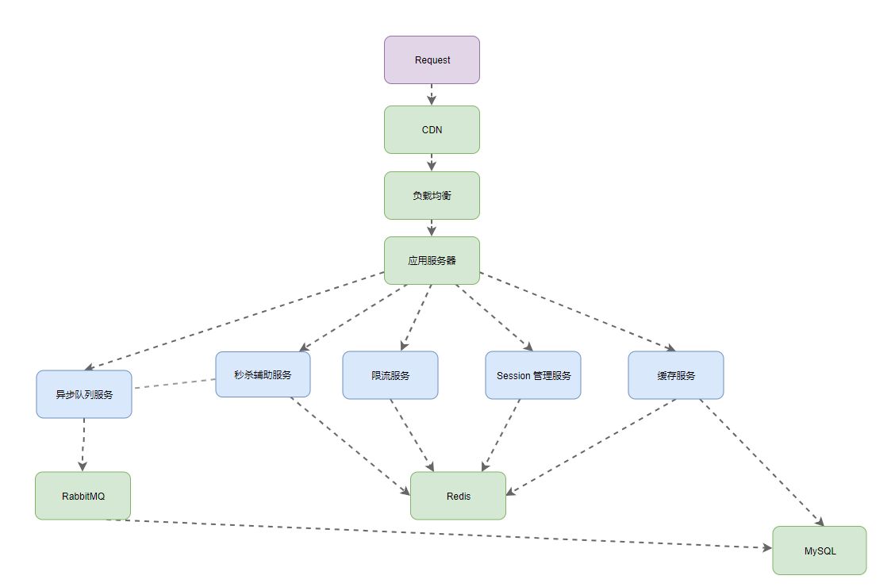
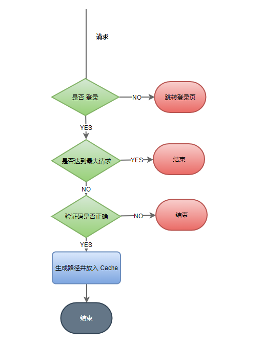
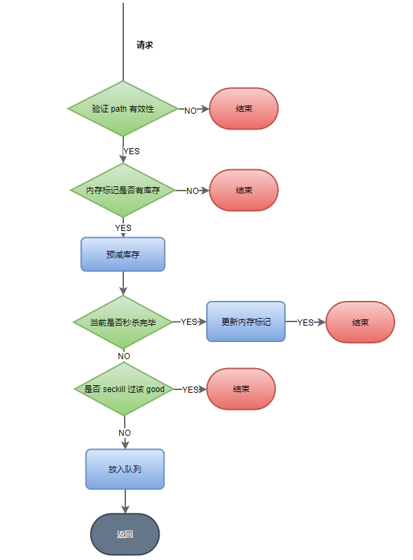
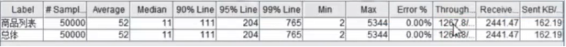
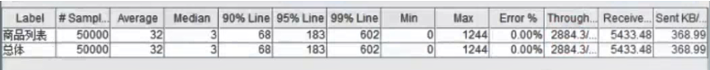
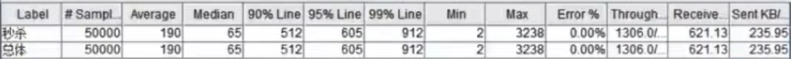
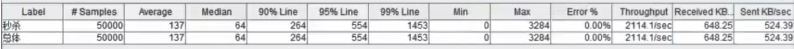

## 在线演示

[Seckill](http://seckill.janh80.com)

```html
账号: 18852860001~18852860012
密码: 123456
```

说明:   
对任意秒杀商品，接口请求限制为 10s 2次;      

单用户只能对秒杀商品秒杀一次；  


## seckill
- 技术：SpringBoot, Mybatis, Redis, RabbitMQ, Thymeleaf 

- 工具： Eclipse, MySQL, JMeter, Git, JSR303

- 描述：基于商城中特定商品的秒杀，指定时间开启和关闭，通过 JMeter 进行测试并发下的性能和安全性。    

  - 前后台两次加密保障用户数据安全，通过 Redis 构建分布式 Session 管理用户信息；
  - 借助 Redis 实现页面、对象缓存配合页面静态化，减少接口的响应时间和传输的网络流量；
  - 通过验证码、动态 URL 配合限流算法来减少并发量，过滤至少 50% 无效的请求；
  - 使用 RabbitMQ 处理写 DB 请求，防止大量请求同时穿透到 DB 造成奔溃；
  - Redis 预减库存、内存标记及队列异步处理减轻Redis, DB 负载，5000 并发下秒杀接口 QPS 提高 62%；


## 项目架构




## 部分说明
**1、 登录与分布式 Session 实现**  

（1） 登录

注： 密码二次加密判断

① JSR303 校验传入的信息；

② 手机号和密码进行对应的判断；

③ 生成 Session，放入 Redis 和 Cookie；

④ 返回成功和失败；

在拦截器中从 Redis 中获取放入到 ThreadLocal  
经过参数拦截器注入到方法参数中，简化获取用户信息  


（2） 每次请求 Session 管理

① SessionInterceptor 根据 请求URL 或 Cookie 获取 Session ，同时重置两者的有效期；

② 将获取到的 Session 放入到 ThreadLocal 中；

③ 对于 AccessInterceptor 从 ThreadLocal 中的 Session 进行之后的访问限制逻辑判断；

④ 对于 UserArgumentResolver 从 ThreadLocal 中获取 Session 将其注入到请求的方法参数中；

⑤ 执行对应的业务；


**2、 验证码 |动态 URL |限流辅助**

过滤到大量无效的请求，至少降低 50 % 的请求；

Redis 中对应的结构：

```shell
# 1.veriCode
SeckillKey:verifyCode:18852860007,5              7
# 2.dynamic path
SeckillKey:seckillPath:18852860000:2			dsjfldsjklfsjdlfjs
# 3.interface access limit
AccessKey:access:/seckill/path:18852860007          1
```

 


**3、 秒杀业务**

核心逻辑：

① 用户对于指定商品的 path 校验；

② 通过内存标记判断是否秒杀结束；

③ 通过Redis 预减库存判断是否秒杀结束，对应更新内存标记；

④ 查询用户是否秒杀过该商品 (缓存或DB获取) ;

⑤ 将用户与商品 ID 放入到消息队列中等待处理；

⑥ 返回；



**4、队列消息处理**

① 转换成对应消息；

② 从 DB 校验商品号和用户；

③ 判断当前商品是否还有库存；

④ 判断用户对于该商品的秒杀情况(Cache OR DB 获得)；

⑤ 执行减库存下订单的操作；


## 测试数据

4 核 CPU，5000 个线程，每个线程 10 次请求；

生成 5000 个用户，获取对应的 token ，通过 JMeter 从配置文件读取执行请求；


（1）/goods/to_list

加入 Redis 页面缓存前后的对比；


① 加入之前

负载 15，QPS 为 1267



② 加入之后

负载 5，QPS 2284

提高 128%




（2） /seckill/do_seckill

加入内存标记，预减库存以及消息队列的前后对比；

5000 个用户同时秒杀一个商品；

① 之前

QPS： 1306




② 之后

QPS: 2114

提高 62%




