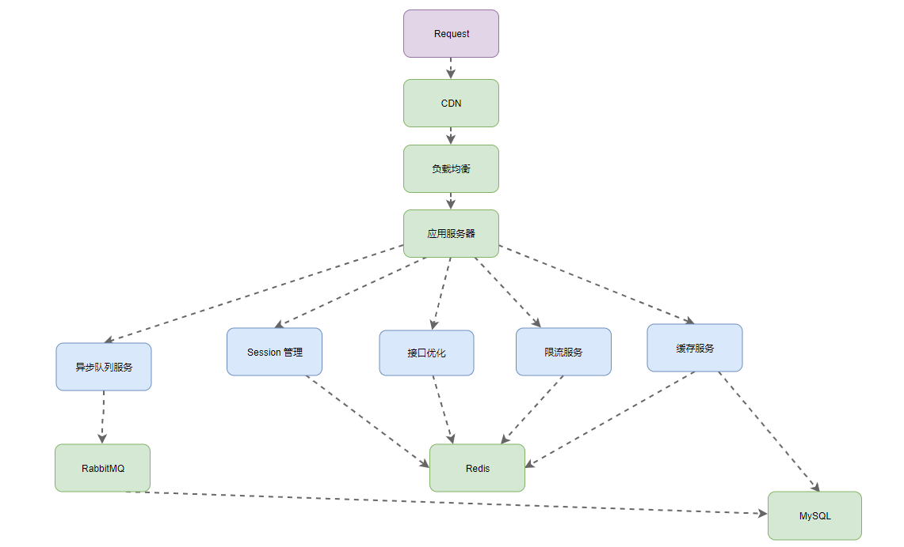

[TOC]


## 项目架构




## 在线演示

[Seckill](http://seckill.janh80.com)

```html
账号: 18852860001~18852860012
密码: 123456
```

说明:   
对任意秒杀商品，接口请求限制为 10s 2次;      

单用户只能对秒杀商品秒杀一次；  


## 对应说明


技术：SpringBoot, Mybatis, Redis, RabbitMQ, Thymeleaf 

工具： Eclipse, MySQL, JMeter, Git, JSR303

描述：独立于原始商城业务，对商城中特定商品的促销活动，形成轰动效应从而进行网站推广。

- 前后台两次加密保障用户密码安全，验证码和动态 URL 保证接口安全；
- Redis 实现分布式 Session，拦截器中通过 ThreadLocal 封装用户信息，参数解析器将用户信息注入到方法参数上减少后续开发成本；
- 借助 Redis 实现页面、对象缓存配合CDN、页面静态化，减少接口的响应时间和网络传输的流量；
- 拦截器配合自定义注解、限流算法来进行接口访问限制，便于权限控制和请求限制，过滤不必要的请求；
- 使用 RabbitMQ 异步处理入库请求，防止大量请求同时穿透到 DB 造成奔溃；
- Redis 预减库存、内存标记减轻 Redis, Server 负载，5000 并发下秒杀接口 QPS 提高 62%；


**1、  Session 管理**  

（1） 登录

注： 密码二次加密判断

① JSR303 校验传入的信息；

② 手机号和密码进行对应的判断；

③ 生成 Session，放入 Redis 和 Cookie；

④ 返回成功和失败；

在拦截器中从 Redis 中获取放入到 ThreadLocal  
经过参数拦截器注入到方法参数中，简化获取用户信息  


（2） 每次请求 Session 管理

① SessionInterceptor 根据 请求URL 或 Cookie 获取 Session ，同时重置两者的有效期；

② 将获取到的 Session 放入到 ThreadLocal 中；

③ 对于 AccessInterceptor 从 ThreadLocal 中的 Session 进行之后的访问限制逻辑判断；

④ 对于 UserArgumentResolver 从 ThreadLocal 中获取 Session 将其注入到请求的方法参数中；

⑤ 执行对应的业务；


**2、 接口优化|限流**

通过验证码获取动态 URL避免接口被刷，保障接口安全性；

接口请求限制过滤掉大量请求，至少降低 50 % 的请求；

Redis 中对应的结构：

```shell
# 1.veriCode
SeckillKey:verifyCode:18852860007,5              7
# 2.dynamic path
SeckillKey:seckillPath:18852860000:2			dsjfldsjklfsjdlfjs
# 3.interface access limit
AccessKey:access:/seckill/path:18852860007          1
```

 

**3、缓存服务**

（1） 缓存页面

通过提供的视图解析器渲染出秒杀商品列表页的前几页

淘汰策略： 通过设置过期时间进行淘汰，时间较短，多页的情况下分开时间进行失效


（2） 缓存秒杀订单

消息队列异步生成订单成功后将其放入 Cache 中，实现在秒杀接口、队列处理、查询秒杀订单时加快查询速度。

淘汰策略： 通过设置过期时间进行淘汰，保证在秒杀活动期间可访问


（3） 库存缓存

项目初始化时预加载库存并放入 Cache 中，在秒杀接口中调用，避免无效的请求。

淘汰策略： 同 （2）


（4） 缓存库存标记

标记商品是否还有库存，在查询结果时无库存直接返回，此时可能用户请求正在消息队列中等待处理，减少响应时间。

淘汰策略： 同 （2）

```shell
# 1. cache page
GoodsKey:goodsList                        html
# 2. cache order
OrderKey:seckillOrder:18852860000:2       seckillOrder
# 3. cache stock
GoodsKey:goodsStock:2                      23
# 4. cache stock tag
Seckill:goodsOver:2                        true
```


**4、队列消息处理**

避免大量请求突然访问 DB 造成奔溃，通过队列缓存进行秒杀的请求；

通过 RabbitMQ 的 Direct 模式直接与 Queue 绑定，发送者发送消息，接受者处理消息；


监听对应的 Queue，在接受到 Message 后接受处理逻辑：

① 转换成对应消息并从 DB 校验商品号和用户；

② 判断当前商品是否还有库存；

③ 判断用户对于该商品的秒杀情况(Cache OR DB 获得)；

④ 执行减库存下订单的操作(放入订单缓存 OR 设置库存标记)；


## 性能测试

4 核 CPU，5000 个线程，每个线程 10 次请求；

生成 5000 个用户，获取对应的 token ，通过 JMeter 从配置文件读取执行请求；


**1、/goods/to_list**

加入 Redis 页面缓存前后的对比；


① 加入之前

负载 15，QPS 为 1267


② 加入之后

负载 5，QPS 2284

提高 128%


**2、/seckill/do_seckill**

加入内存标记，预减库存以及消息队列的前后对比；

5000 个用户同时秒杀一个商品；

① 之前

QPS： 1306


② 之后

QPS: 2114

提高 62%


## 其他说明

**1、 秒杀业务**

核心逻辑：

① 用户对于指定商品的 path 校验；

② 通过内存标记判断是否秒杀结束；

③ 通过Redis 预减库存判断是否秒杀结束，对应更新内存标记；

④ 查询用户是否秒杀过该商品 (缓存或DB获取) ;

⑤ 将用户与商品 ID 放入到消息队列中等待处理；

⑥ 返回；


**2、Redis 键设计**

模板方法模式构建；

抽取出 Redis KEY 需要的前缀与过期时间作为接口；

通过抽象类定义通用的变量和接口的实现；

每个模块对应一个类，通过带有语义的变量名区分模块中的 KEY；

```java
interface KeyPrefix {
	int expireSeconds();
	String getPrefix();
}
```

```java
abstract class BasePrefix implements KeyPrefix{
	private int expireSeconds;
	private String prefix;
    @Override
    public int expireSeconds() {
        return expireSeconds;
    }
    @Override
    public String getPrefix() {
        String className = this.getClass().getSimpleName();
        return new StringBuffer().append(className).append(Const.SPLIT).append(prefix).toString();
    }
}
```

```java
class AccessKey extends BasePrefix{
	private AccessKey(int expireSeconds, String prefix) {
		super(expireSeconds, prefix);
	}
	public static AccessKey createByExpire(int expireSeconds) {
		return new AccessKey(expireSeconds, "accessLimit");
	}
}
```


**3、HashMap 作为内存标记**

安全性说明：

初始时，是通过预加载库存信息并进行对应的设置，单线程保证了安全性；

之后操作过程中无 put 操作，不会出现值覆盖与扩容过的问题；

对 VALUE 的更新仅为一次，不可回退；


相较于并发下使用 ConcurrentHashMap 效率更高；

初始设置容量为商品总数避免不必要的扩容开销；


