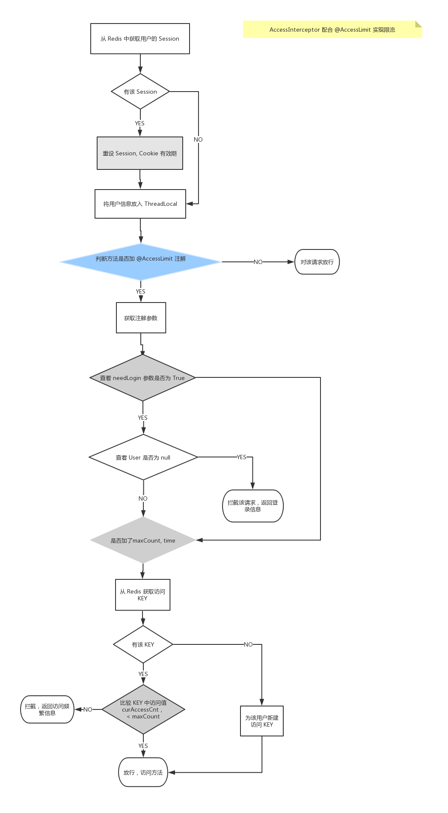
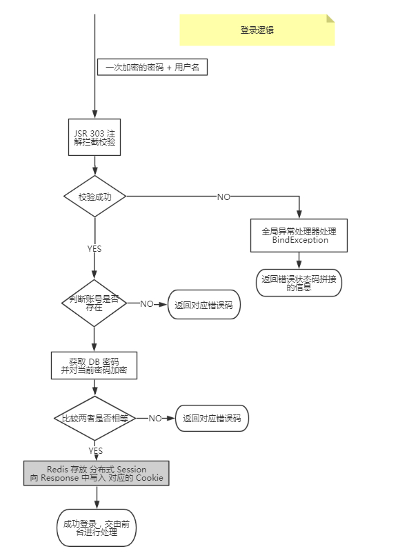
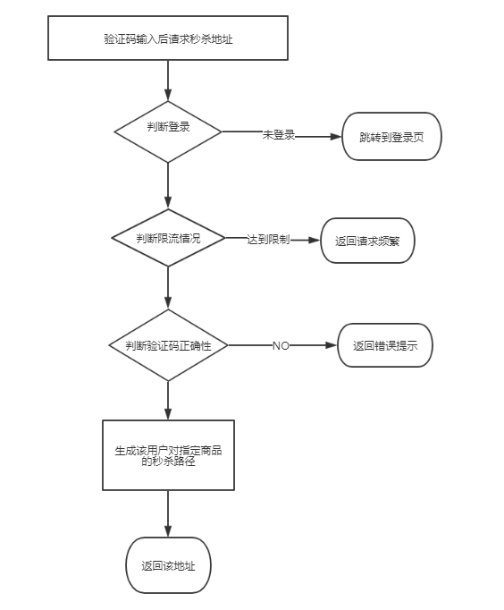
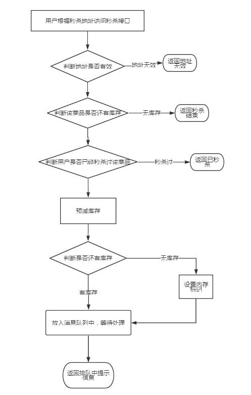

# seckill
**技术：**SpringBoot、MyBatis、Redis、RabbitMQ、Thymeleaf、Lombok

**功能：**  
密码两次MD5加密  
Redis 实现分布式 Session

高并发优化:  
- 页面优化: 页面(html)缓存、页面静态化缓存到客户端、对象缓存
- 安全优化: 秒杀地址隐藏、验证码验证、接口限流
- 接口优化: 验证码、Redis预减库存、内存标记减少Redis访问、RabbitMQ异步下单

## 通用部分
**访问拦截：**

**分布式 Session:**  
在拦截器中从 Redis 中获取放入到 ThreadLocal  
经过参数拦截器注入到方法参数中，简化获取用户信息  

**接口访问监测:**  
编写接口切面，记录访问接口与 IP 的情况     

测试数据如下  

**限流策略:**  
对指定用户某个访问接口的控制  

## 业务部分
**登录**

**获取秒杀路径:**   

**执行秒杀：**  
对于每个用户只能够秒杀一件商品

## 其他

秒杀策略1： 每个用户对一件商品只能生成一个订单  

通过减库存加条件 + DB 中唯一索引 + DB 中事务的回滚避免超卖  

 秒杀策略2： 每个用户可对同一件商品秒杀多次  

Redis 构建分布式锁

